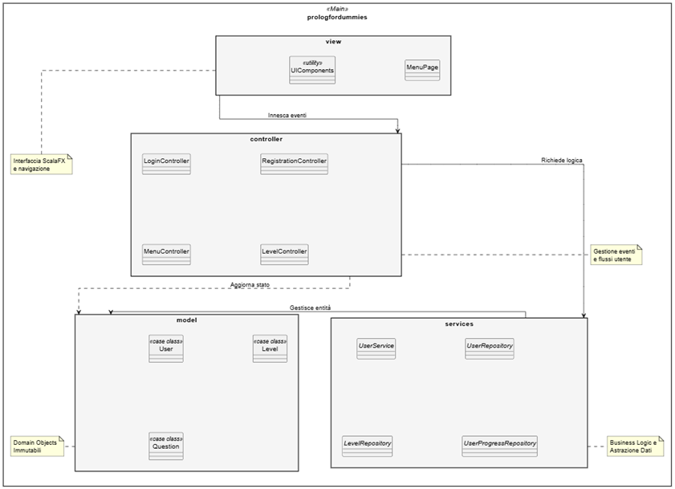

#  Design Architetturale

---

## Pattern Architetturale

L'architettura di Prolog for Dummies è stata progettata seguendo i principi della programmazione funzionale e reattiva, garantendo un sistema robusto e privo di effetti collaterali. 
L'approccio funzionale si concretizza nell'adozione sistematica dell'immutabilità per l'intero dominio del modello: entità come utenti, livelli e quesiti sono gestite tramite case class di Scala 3, assicurando che ogni variazione di stato produca nuove istanze anziché modificare quelle esistenti. 
Parallelamente, la natura reattiva del sistema permette all'interfaccia utente in ScalaFX di operare secondo un paradigma event-driven, in cui gli input dell'utente attivano flussi di elaborazione asincroni gestiti dai controller. 

---

## Architettura del Progetto

Il sistema adotta un pattern Model-View-Controller (MVC) esteso con uno strato di Service e Repository per ottimizzare la separazione delle responsabilità (Separation of Concerns).

**Repository Pattern**: Isola la logica di accesso ai dati (JSON), rendendo il resto dell'applicazione indipendente dai dettagli della persistenza.

**Service Layer**: Centralizza la Business Logic, fungendo da mediatore tra i Controller e i Repository per garantire riusabilità e facilità di testing.

Questa struttura a strati permette di evolvere il sistema senza impattare sull'interfaccia utente o sul flusso di controllo.

  

### Model

Composto da case class immutabili (User, Level, Question). L'immutabilità è una scelta architetturale cruciale: ogni variazione di stato (es. una risposta corretta) non modifica l'oggetto esistente ma produce una nuova versione del modello, garantendo thread-safety e facilità di testing.

### View

Sviluppata in ScalaFX, adotta un approccio gerarchico e dichiarativo. La navigazione è centralizzata, garantendo una transizione fluida tra i diversi stati dell'applicazione. I componenti dell'interfaccia sono stati progettati per essere altamente modulari e riutilizzabili (grazie alla classe UIComponents), permettendo di mantenere coerenza grafica e facilità di estensione.

### Controller

Agisce come orchestratore. Riceve gli input dalla View e interagisce con i Service. Non contiene logica di business complessa, ma delega la validazione e il salvataggio agli strati inferiori.

### Service & Repository Pattern

Introdotto per astrarre la persistenza. Il UserService coordina le operazioni di business, mentre le interfacce Repository isolano l'applicazione dal formato di archiviazione fisico (JSON). Questo permette, in futuro, di sostituire il database senza modificare troppo la logica dei controller.

## Componenti del Sistema e Logica di Valutazione ##

Sebbene l'applicazione sia attualmente standalone, l'architettura è predisposta per una futura evoluzione distribuita. Un componente chiave è il Motore di Valutazione Prolog:

Integrazione tuProlog: Il sistema incapsula una libreria di interpretazione Prolog. Questa scelta permette di separare il "cosa" viene insegnato  dal "come" viene gestito il quiz.

Validazione Dinamica: A differenza di un quiz a risposta multipla statico, il sistema può interrogare una base di conoscenza reale per verificare la correttezza delle query scritte dall'utente.

## Scelte Tecnologiche Cruciali
Le decisioni tecniche che hanno plasmato l'architettura includono:

**Scala 3:** L'utilizzo delle given e dei parametri contestuali permette di implementare un pattern di Dependency Injection nativo. Questo riduce drasticamente l'accoppiamento tra i Controller e le implementazioni concrete dei Repository, facilitando lo switch tra diverse strategie di persistenza (ad esempio, passando da un'archiviazione su file a una in-memory) senza modificare la logica dei client.

**JSON (uPickle):** Scelto come formato di persistenza per la sua leggibilità e facilità di debug. L'uso del formato JSON permette una gestione dei dati "file-based", eliminando la necessità di configurare database tradizionali e garantendo la massima portabilità dell'applicativo (Zero-Config Deployment).

**Pattern Either per l'Error Handling:** Al posto delle eccezioni, i servizi restituiscono tipi Either[String, A]. Questa scelta architetturale impone una gestione esplicita dei fallimenti nei controller, rendendo l'applicazione più robusta e priva di crash imprevisti.

  <a href="design_dettaglio.html"> Design di Dettaglio →</a>

