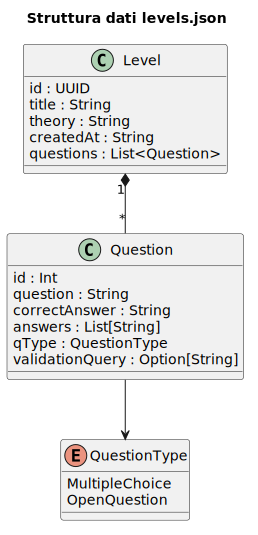
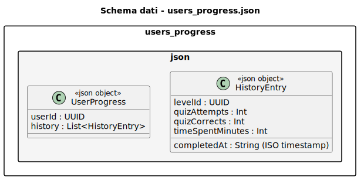
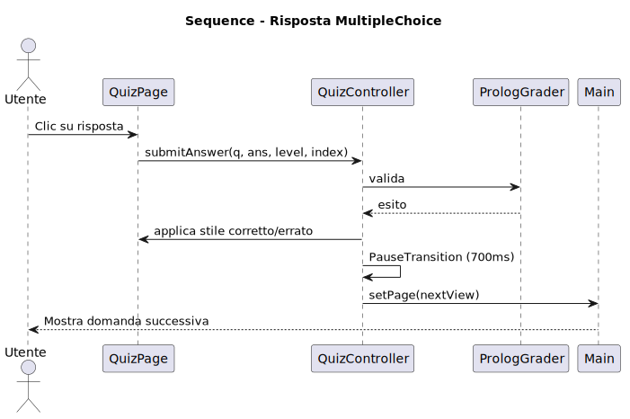

# Design di Dettaglio

---

Questo documento descrive il funzionamento dettagliato dei principali componenti del sistema **Prolog for Dummies**, evidenziando responsabilità, interazioni e flussi applicativi tra i vari strati dell’architettura.

Il progetto è organizzato secondo un approccio **MVC esteso** con layer aggiuntivi di **Service** e **Repository**, così da garantire separazione delle responsabilità, manutenzione semplice ed estendibilità.

---

## Vista generale dei componenti

Il sistema è composto da:

- **Model**: rappresenta il dominio applicativo e i dati persistenti/in memoria;
- **View**: gestisce l’interfaccia grafica e l’interazione con l’utente;
- **Controller**: coordina il flusso tra interfaccia e logica applicativa;
- **Service**: gestisce la comunicazione tra i componenti necessari per la logica applicativa;
- **Repository**: gestisce l’accesso ai dati su file JSON;
- **Motore Prolog**: valuta le risposte degli esercizi basati su Prolog.

---

## Design del Model

Il livello di dominio è stato progettato in modo da privilegiare **immutabilità**, **coerenza dei dati** e **riuso della logica di calcolo**.

### Entità principali

#### User
Rappresenta l’utente dell’applicazione. Contiene le informazioni necessarie per autenticazione ed il salvataggio dei progressi.

#### Level
Rappresenta un livello del percorso didattico. Ogni livello contiene:
- contenuto teorico;
- una sequenza di domande a risposta multipla o aperte;
- metadati utili alla navigazione e alla valutazione.

#### Dettaglio del livello

  

#### Question
Rappresenta una singola domanda del quiz. Il modello supporta tipologie differenti, in particolare:
- **MultipleChoice**
- **OpenQuestion / Fill-in-the-blank**

#### UserProgress
Aggrega la cronologia dei progressi utente, registrando per ogni livello completato i relativi KPI e dati di sessione.

#### Dettaglio di UserProgress

  

#### LevelRecord
Modella il completamento di un singolo livello, includendo i dati raccolti durante la sessione di gioco.

---

### Principi di progettazione applicati

#### Immutabilità
Le entità del dominio sono state progettate come strutture immutabili, così da evitare modifiche accidentali e rendere il flusso dei dati più prevedibile.

#### Rich Domain Model
Alcuni calcoli, come:
- ore totali di utilizzo,
- numero di risposte corrette,
- accuratezza globale,

sono incapsulati direttamente nel modello, riducendo la complessità dei controller.

#### State Management
La gestione della sessione di livello si basa su uno stato esplicito, distinguendo tra:
- **Idle**: nessun livello in corso;
- **ActiveLevel**: livello attivo con contatori e timestamp.

Questo approccio evita incoerenze tra stato temporaneo e dati persistenti.

---

## Design della persistenza

La persistenza è stata progettata con un approccio **file-based JSON**, per semplificare il deployment e mantenere l’applicazione portabile.

### Repository Pattern
Ogni entità principale possiede:
- una trait repository;
- una implementazione concreta `Impl`.

I repository astraggono l’accesso ai dati e permettono di modificare facilmente la tecnologia di persistenza in futuro.

### Entità persistite
Le informazioni salvate su file riguardano principalmente:
- utenti;
- progressi utente;
- livelli.

### Strategia di aggiornamento
Per i progressi utente viene adottato un approccio **read-modify-write**, che:
1. legge lo stato corrente dal file;
2. aggiorna solo la porzione necessaria;
3. riscrive il contenuto in modo coerente.

Questa soluzione riduce il rischio di perdita dati e mantiene il formato semplice da gestire.

---

## Design del layer Service

Il layer di servizio ha il compito di centralizzare la **business logic** e di fare da intermediario tra controller e repository.

### UserService
Si occupa delle operazioni sugli utenti, tra cui:
- registrazione;
- validazione dei dati;
- gestione degli errori;
- controllo dei duplicati.

L’uso di `Either[String, A]` consente di rappresentare in modo esplicito i fallimenti senza ricorrere a eccezioni come meccanismo ordinario di controllo del flusso.

### PrologGrader
È il componente responsabile della valutazione delle risposte basate su Prolog.

In particolare:
- verifica la correttezza sintattica;
- unisce conoscenza del livello e soluzione dell’utente;
- esegue la query di test;
- determina l’esito della risposta.

Questo permette di distinguere tra:
- correttezza testuale;
- correttezza logico-sintattica.

---

## Design dei Controller

I controller hanno la funzione di coordinare il flusso tra interfaccia utente e servizi, senza contenere logica di business complessa.

### Responsabilità generali
Ogni controller:
- riceve gli eventi dalla View;
- valida gli input minimi;
- invoca i service o i repository;
- aggiorna la navigazione;
- gestisce eventuali messaggi di errore o feedback.

### Iniezione delle dipendenze
La progettazione sfrutta i meccanismi di Scala 3 con:
- `given`
- parametri contestuali `using`

per ottenere una forma di dependency injection nativa e poco invasiva.

### Controller principali
I controller coprono le funzionalità principali del sistema:
- autenticazione;
- registrazione;
- modifica utente;
- navigazione menu;
- selezione dei livelli;
- gestione del quiz;
- visualizzazione statistiche.

---

## Design della View

La View è stata realizzata con **ScalaFX**, con un approccio dichiarativo e modulare.

### Principi adottati

#### Coerenza visiva
L’interfaccia mantiene uno stile uniforme grazie alla centralizzazione di componenti riutilizzabili.

#### Riutilizzo
Sono stati definiti componenti comuni per:
- pulsanti;
- layout base;
- modali personalizzate;
- navigazione tra schermate.

#### Separazione delle responsabilità
La View si occupa solo della presentazione e dell’interazione, delegando la logica applicativa ai controller.

### Schermate principali
Le principali schermate dell’applicazione includono:
- splash screen;
- login;
- registrazione;
- modifica profilo;
- menu principale;
- elenco livelli;
- quiz(a risposta multipla o aperta);
- statistiche utente.

### Dialoghi e feedback
Le finestre di conferma personalizzate sono state progettate per garantire coerenza grafica ed un controllo maggiore dell’esperienza utente.

---

## Design del flusso di navigazione

Il flusso applicativo segue una sequenza chiara:

1. avvio dell’applicazione;
2. accesso o registrazione utente;
3. visualizzazione menu principale;
4. selezione del livello;
5. svolgimento del quiz;
6. conclusione del livello;
7. aggiornamento progressi;
8. consultazione statistiche.

Questo flusso consente all’utente di muoversi in modo intuitivo nel percorso didattico.

#### Dettaglio di sequenza del quiz

  

---

## Design della valutazione dei quiz

La valutazione delle risposte varia in base alla tipologia di domanda.

### Domande a scelta multipla
La risposta viene verificata confrontando la soluzione proposta con quella corretta, passando attraverso il motore Prolog per validazioni sintattiche.

### Domande aperte / fill-in-the-blank
La risposta viene inserita dall’utente e controllata sia dal punto di vista sintattico sia logico tramite il motore Prolog.

### Gestione dell’errore
In caso di risposta non valida o eccezione interna:
- l’esito viene considerato negativo;
- l’applicazione continua a funzionare senza interrompere il flusso.

---

## Gestione dei progressi utente

Il sistema mantiene traccia dei progressi per ogni utente autenticato.

### Dati registrati
Per ogni livello completato vengono salvati:
- tempo impiegato;
- numero di tentativi;
- numero di risposte corrette;
- numero di risposte totali;
- timestamp della sessione.

### KPI calcolati
Dal modello vengono derivati indicatori utili alla visualizzazione delle statistiche:
- livelli completati;
- percentuale di accuratezza;
- tempo complessivo di utilizzo;
- quiz tentati.

---

## Gestione degli errori

Il progetto adotta un approccio prudente e controllato nella gestione degli errori.

### Scelte progettuali
- uso di `Either` nei servizi;
- validazione preventiva degli input;
- fallback sicuri nei repository;
- controllo dello stato della sessione prima delle operazioni.

### Obiettivo
Evitare crash imprevisti e mantenere l’applicazione stabile anche in presenza di dati incoerenti o input non validi.

---

## Scelte tecnologiche rilevanti

Le principali scelte adottate nel design di dettaglio sono:

- **Scala 3.8.1**: per il supporto a `given`, `using` e sintassi moderna;
- **ScalaFX**: per l’interfaccia grafica desktop;
- **uPickle**: per serializzazione e deserializzazione JSON;
- **tuProlog**: per la valutazione delle query Prolog;
- **SBT**: per build e dipendenze;
- **Java 21**: come runtime di esecuzione.

---

## Considerazioni finali

Il design di dettaglio è stato pensato per garantire:
- modularità;
- estendibilità;
- chiarezza dei flussi;
- semplicità di manutenzione;
- coerenza tra parte didattica, logica applicativa e interfaccia utente.

L’architettura ottenuta consente di aggiungere nuovi livelli, nuove domande e ulteriori funzionalità senza dover stravolgere le componenti già esistenti.

  <a href="implementazione.html"> Implementazione →</a>

