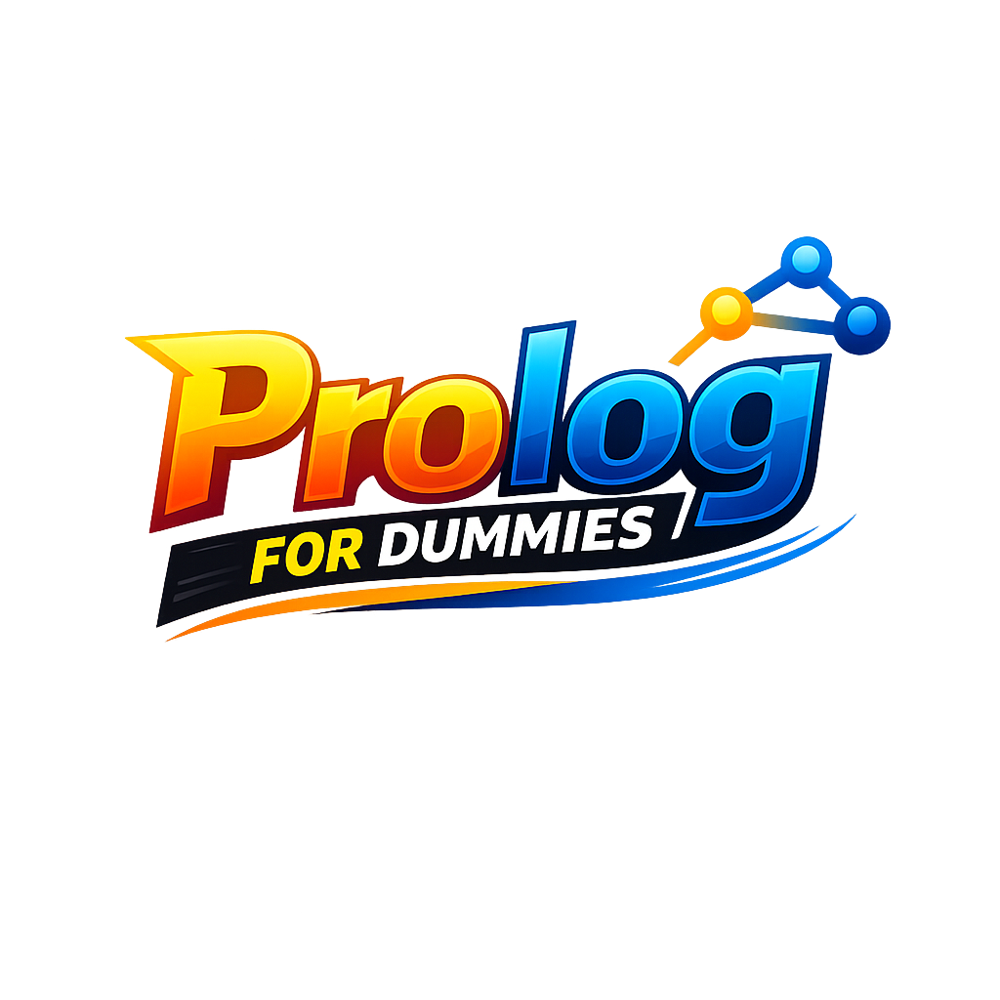

  

# Introduzione

Questo progetto nasce per offrire un supporto **interattivo e strutturato** a chi si avvicina al linguaggio **Prolog**. L’applicazione desktop non si limita a presentare contenuti, ma guida l’utente in un vero e proprio **percorso didattico progressivo**: ogni livello rappresenta un tassello fondamentale che introduce nuovi concetti della programmazione logica, bilanciando in modo efficace teoria ed esercitazioni pratiche.

Per consolidare l’apprendimento, il sistema propone **quiz a risposta multipla** e attività di **completamento (fill-in-the-blank)**.

## Funzionalità principali

- **Accesso riservato:** gestione del profilo tramite autenticazione utente.
- **Curriculum strutturato:** percorso di apprendimento organizzato per livelli di difficoltà.
- **Didattica interattiva:** quiz mirati con correzione automatica e istantanea.
- **Dashboard dei progressi:** monitoraggio continuo del percorso con statistiche su livelli completati, punteggi e percentuale di avanzamento.

