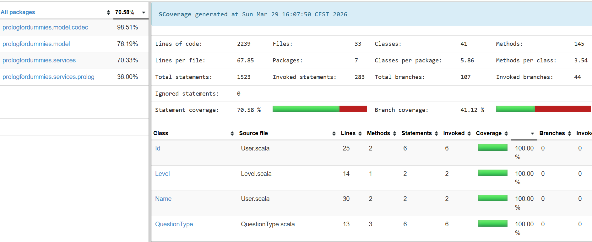

#  Testing

---

La strategia di testing adottata si è focalizzata sulla robustezza del **Model** e della **Business Logic**, garantendo che il cuore applicativo (motore Prolog e gestione sessioni) sia resiliente a stati inconsistenti o input errati.

#### Tecnologie e Metodologia

* **Framework**: Abbiamo utilizzato **ScalaTest** adottando la suite **AnyFunSuite** per la sua chiarezza nell'esecuzione dei test.
* **Lifecycle Management**: Grazie al trait **BeforeAndAfterEach**, abbiamo garantito l'isolamento dei test resettando lo stato dei componenti singleton, come `LevelSession`, prima di ogni esecuzione.

#### **Coverage e Grado di Copertura**
L'analisi della copertura del codice è stata effettuata tramite lo strumento **Scoverage**:

<p align="center">
  
</p>

# Analisi della Copertura e Strategia di Testing

L'attività di testing è stata focalizzata sul **kernel logico** dell'applicazione, garantendo stabilità dove il rischio di bug critici è maggiore.

---

## Risultati di Copertura (Scoverage)

I dati estratti mostrano un'eccellente affidabilità dei componenti core:

* **`model.codec` (98.51%)**: Copertura pressoché totale. Garantisce l'integrità della serializzazione JSON e della persistenza dei dati.
* **`model` (76.19%)**: Elevata robustezza nella gestione degli stati e delle entità di dominio.
* **`services` (70.33%)**: Solida validazione dei repository e della business logic di gestione utente.
* **`services.prolog` (36.00%)**: Copertura focalizzata sui flussi principali di validazione.

Da questi dati sono esclusi i componenti puramente visuali e di coordinamento (View e Controller), i quali sono stati testati manualmente.

---

#### **Esempi Rilevanti di Testing**

##### **1. Gestione della Sessione di Gioco (LevelSession)**
Il test verifica che la `LevelSession` gestisca correttamente i contatori dei tentativi e che resetti lo stato dopo la chiusura di un livello.

```scala
test("addAttempt dovrebbe aggiornare i contatori dei Quiz tentati e corretti") {
  val levelId = Level.Id.random
  LevelSession.startLevel(levelId)
  LevelSession.addAttempt(isCorrect = true)
  LevelSession.addAttempt(isCorrect = false)
  LevelSession.addAttempt(isCorrect = true)

  val stats = LevelSession.currentStats.getOrElse((0, 0))
  assert(stats._1 == 3) // 3 tentativi totali
  assert(stats._2 == 2) // 2 risposte corrette
}

test("endLevel dovrebbe restituire i dati finali e tornare allo stato Idle") {
  LevelSession.startLevel(Level.Id.random)
  LevelSession.addAttempt(isCorrect = true)

  val finalData = LevelSession.endLevel().getOrElse(fail("Dati mancanti"))
  assert(finalData.quizCorrects == 1)
  assert(LevelSession.currentStats.isEmpty) // Stato resettato correttamente
}
```

##### **2. Test per la valutazione di domande aperte con validazione Prolog**
Il test verifica che la logica inserita dall'utente sia semanticamente corretta. A differenza di un semplice confronto testuale, il sistema utilizza il motore **tuProlog** per verificare se il codice dell'utente soddisfa il `validationQuery` (Goal) impostato per il quiz.

```scala
  test("Valutazione logica Prolog - caso positivo") {
    val staticTheory = "parent(abramo, isacco). parent(isacco, giacobbe)."
    val userCode = "nonno(X, Y) :- parent(X, Z), parent(Z, Y)."
    val goal = "nonno(abramo, giacobbe)."

    val q = Question(
      id = 1,
      question = "Definisci la regola nonno",
      correctAnswer = "",
      answers = List.empty,
      qType = QuestionType.OpenQuestion,
      validationQuery = Some(goal)
    )

    assert(q.isCorrect(userCode, staticTheory))
  }
```

<p align="right">
  <a href="retrospettiva.html"> Retrospettiva →</a>
</p>